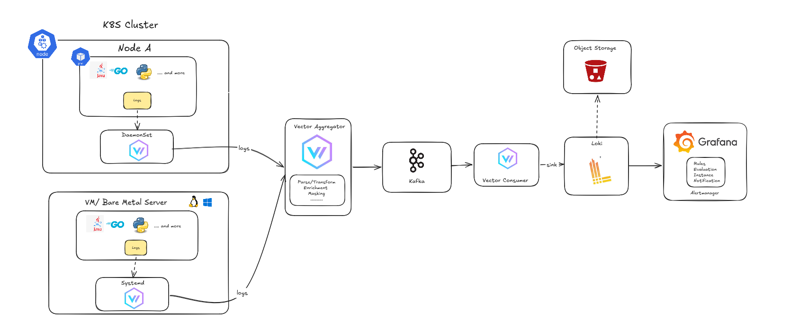

# Task 02 - Centralized Log Management Design

This document describes a centralized log management system for **1,000-2,000
endpoints**, including servers, network devices, and applications.

## Deliverable

## 1. Collection and Transport Architecture

The ingestion path is split by source type because not every endpoint can run an
agent. All paths converge at the Vector aggregation tier.

| Source class            | Collection mechanism                                                                                  | Transport into pipeline |
| ----------------------- | ----------------------------------------------------------------------------------------------------- | ----------------------- |
| Kubernetes / containers | Node-level Vector DaemonSet tails container stdout/stderr and enriches pod metadata                   | Vector aggregation LB   |
| VM / bare-metal servers | Local Vector agent tails `journald` and local log files such as `/var/log/*.log`                      | Vector aggregation LB   |
| Network devices         | Agentless syslog from switches, routers, and firewalls over UDP/TCP 514 into a Vector syslog listener | Vector aggregation LB   |
| Applications            | Structured JSON logs via stdout, files, or direct HTTP/Vector sink                                    | Vector aggregation LB   |

The Vector aggregation layer runs as **2 or more instances behind a load
balancer**. Edge agents buffer locally if the aggregation tier is temporarily
unreachable. Aggregators write to Kafka so ingestion is decoupled from storage;
Kafka absorbs spikes such as firewall log storms and allows Loki maintenance
without dropping logs.

## 2. Parsing, Normalization, and Enrichment

Vector performs processing before logs enter durable storage.

- **Parsing at the edge:** Vector agents parse JSON, syslog, container logs,
  `journald`, and common application/system formats close to the source.
- **Normalization at aggregation:** central Vector aggregators normalize
  timestamps to UTC, map log levels into a common schema, and standardize field
  names such as `host`, `service`, `environment`, `cluster`, and `severity`.
- **Enrichment:** records are enriched with host metadata, Kubernetes pod labels,
  service name, environment, cluster, and device metadata for network sources.
- **Redaction:** passwords, tokens, and PII are masked or dropped before logs
  reach Kafka, Loki, or S3.

This keeps the storage layer clean and makes queries predictable across
different log sources.

## 3. Storage, Retention, and Archival Policy

This design uses a split-tier model instead of one large datastore.

- **Kafka buffer:** keeps logs for **24 hours to 7 days**. It is the
  backpressure and replay layer, not the long-term system of record.
- **Loki hot tier:** stores recent searchable logs for **90 days**. Loki runs in
  distributed mode with separate distributors, ingesters, and queriers, using S3
  as the chunk backend.
- **S3 archive tier:** stores compressed raw logs for **365 days** with lifecycle
  policies for deletion or transition to colder storage.

This keeps operational queries fast while keeping long-term retention cheaper.

## 4. Technology Choices and Tradeoffs

- **Vector over Fluentd/Logstash:** lower memory footprint per agent, one binary
  for edge and aggregation roles, high throughput, and built-in parsing,
  enrichment, and redaction.
- **Kafka over direct agent-to-storage:** Kafka decouples producers from
  consumers, absorbs bursts, and provides a durability boundary when Loki or the
  archive path is unavailable.
- **Loki over OpenSearch/Elasticsearch:** Loki indexes labels instead of full
  log text, so it is cheaper to run at this scale and works naturally with
  object storage.
- **Tradeoff:** Loki is weaker for ad-hoc full-text analytics. For operational
  troubleshooting, filtering by labels such as service, host, environment, and
  severity before searching within streams is the right cost/performance trade.
  If the requirement becomes SIEM-grade search, the storage tier can be swapped
  to OpenSearch while keeping the Vector -> Kafka ingestion path.

## 5. Capacity and Availability Assumptions

Sizing should be validated with real traffic, but the initial design assumes:

- **Scale:** 1,000-2,000 endpoints.
- **Ingest estimate:** up to ~5 GB/day per endpoint at the high end, or about
  **5-10 TB/day raw** and **100k-200k events/sec** at peak.
- **Kafka:** 3 brokers, replication factor 3, and 12 or more partitions so
  Vector consumers can scale horizontally.
- **Vector aggregation:** start with 2-3 instances behind a load balancer and
  scale based on CPU, network, and Kafka producer lag.
- **Loki:** distributed deployment with replicated ingesters and S3-backed
  chunks.

No tier should be a single point of failure. Edge agents buffer locally,
aggregation runs behind a load balancer, Kafka is replicated, and Loki uses
distributed components with object storage for durable chunks.
